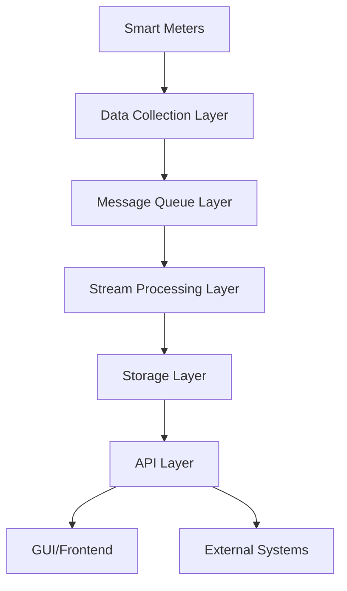
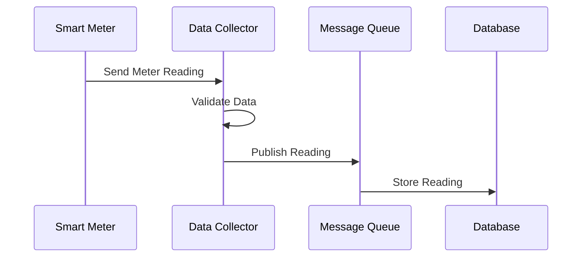
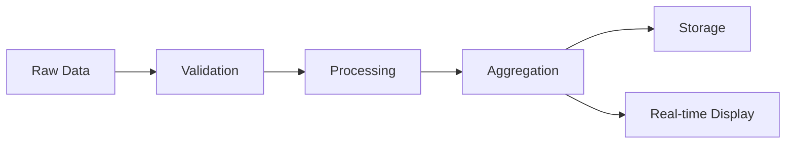
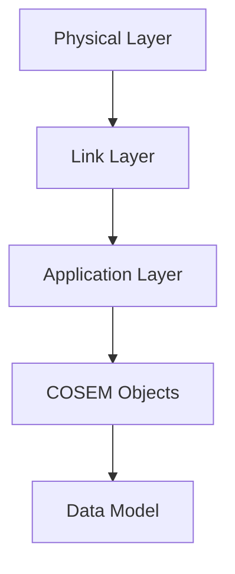
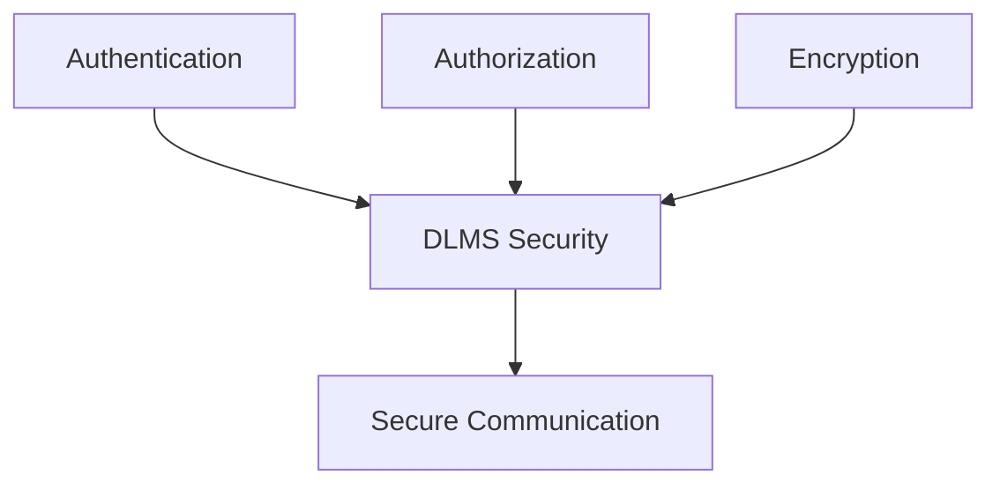
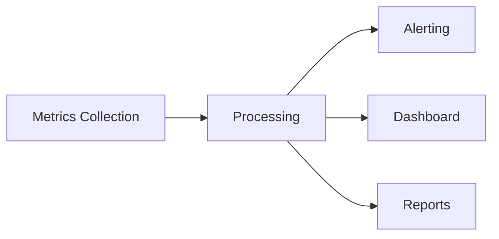
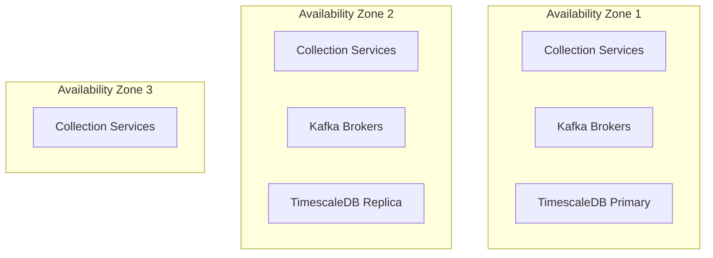

# HES (Head End System) - System Overview
## Technical Documentation & Presentation Material

### Table of Contents
1. System Architecture
2. Data Flow
3. Key Components
4. Protocol Integration
5. Security Features
6. Monitoring & Operations

---

## 1. System Architecture

### High-Level Architecture

### Component Breakdown
- **Data Collection Layer**: DLMS/COSEM Protocol Handlers
- **Message Queue**: Kafka-based Event Processing
- **Stream Processing**: Apache Flink for Real-time Analytics
- **Storage**: TimescaleDB + Redis Cache
- **API Layer**: RESTful Services
- **GUI**: React-based Dashboard

---

## 2. Data Flow

### Meter Data Collection Flow

### Real-time Processing Flow

---

## 3. Key Components

### Core Modules
1. **hes-data-collector**
   - DLMS Protocol Implementation
   - Meter Communication
   - Data Validation

2. **hes-common**
   - Shared Models
   - Utilities
   - Common Configurations

3. **hes-microservice**
   - REST APIs
   - Business Logic
   - Integration Points

4. **hes-gui**
   - Web Dashboard
   - Real-time Monitoring
   - User Interface

---

## 4. Protocol Integration

### DLMS/COSEM Implementation

### Supported Measurements
- Active Energy Import (kWh)
- Voltage (V) - Three Phase
- Current (A) - Three Phase
- Frequency (Hz)
- Power Factor
- Reactive Power

---

## 5. Security Features

### Security Layers

### Security Measures
1. DLMS Authentication
2. Data Encryption
3. Access Control
4. Audit Logging
5. Key Management

---

## 6. Monitoring & Operations

### System Monitoring

### Key Metrics
- Meter Connection Status
- Reading Success Rate
- Data Quality Metrics
- System Performance
- Error Rates

---

## Performance Statistics

### System Capacity
- Handles 1M+ meters
- 6 readings per meter / 30 minutes
- ~12M readings / 30 minutes
- ~1.2GB data / 30 minutes

### Scalability Features
- Horizontal Scaling
- Load Balancing
- Data Partitioning
- Caching Strategy

---

## Implementation Details

### Technology Stack
1. **Backend**
   - Java 21
   - Spring Boot 3.2.3
   - Apache Kafka
   - Apache Flink

2. **Frontend**
   - React
   - Material-UI
   - WebSocket
   - Charts & Visualizations

3. **Database**
   - TimescaleDB
   - Redis Cache

---

## Deployment Architecture

### Production Environment

---

## Best Practices & Guidelines

### Development Guidelines
1. Code Quality Standards
2. Testing Requirements
3. Documentation
4. Security Protocols
5. Performance Optimization

### Operational Guidelines
1. Monitoring Procedures
2. Incident Response
3. Backup Strategy
4. Scaling Procedures
5. Maintenance Windows

---

## Contact & Support

### Key Resources
- Technical Documentation
- API Documentation
- Troubleshooting Guide
- Support Channels
- Emergency Contacts

---

*Note: This document serves as both a presentation resource and technical documentation. For detailed implementation specifics, please refer to the codebase and associated documentation.* 