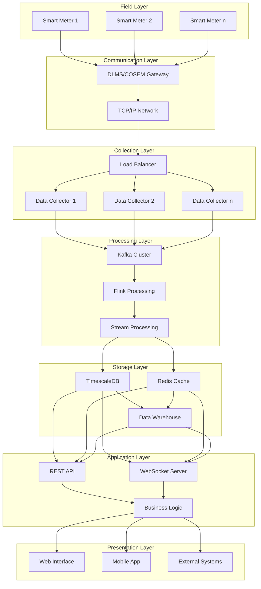
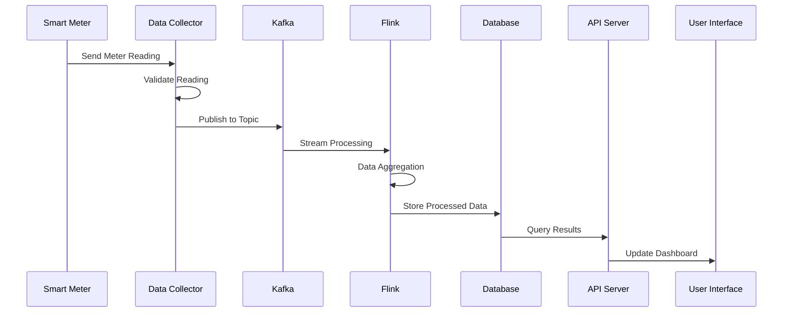
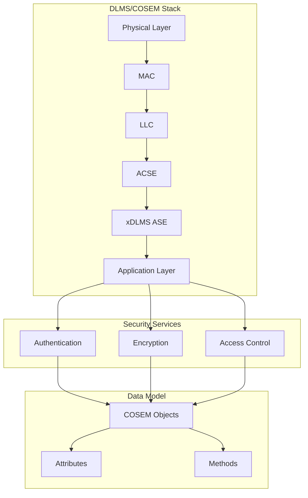
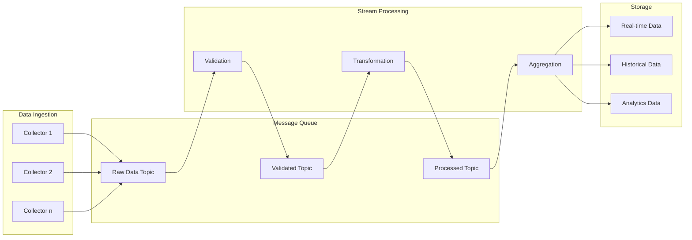
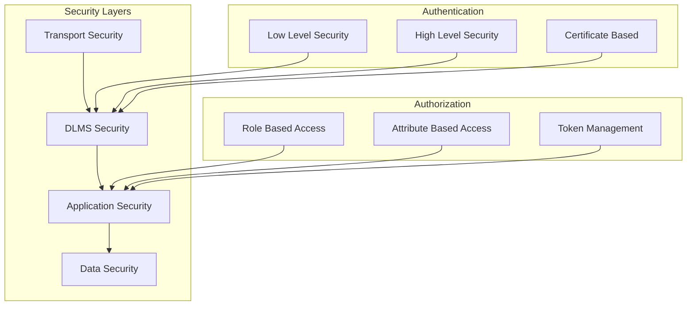
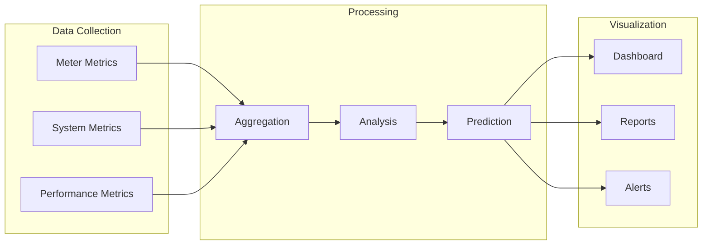
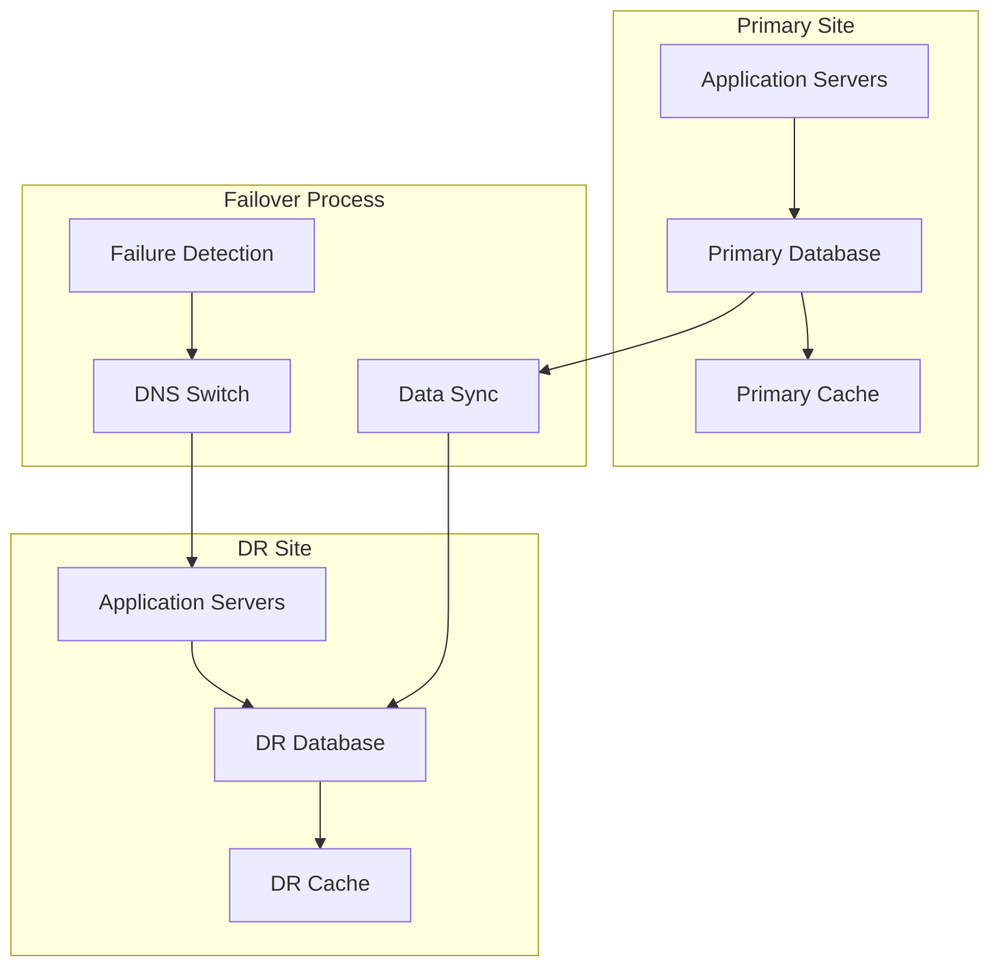

# HES System - High-Level Design Document

## System Overview Diagram


## Detailed Data Flow


## DLMS/COSEM Protocol Stack


## Real-time Processing Pipeline


## Security Architecture


## Deployment Architecture
```mermaid
graph TB
    subgraph "Production Environment"
        subgraph "Zone 1"
            LB1[Load Balancer]
            APP1[Application Servers]
            DB1[Database Primary]
        end

        subgraph "Zone 2"
            LB2[Load Balancer]
            APP2[Application Servers]
            DB2[Database Replica]
        end

        subgraph "Zone 3"
            LB3[Load Balancer]
            APP3[Application Servers]
            DB3[Database Replica]
        end
    end

    subgraph "Monitoring"
        MON[Monitoring System]
        LOG[Log Aggregation]
        ALERT[Alert System]
    end

    Zone 1 <--> Zone 2
    Zone 2 <--> Zone 3
    Zone 1 & Zone 2 & Zone 3 --> MON
    MON --> LOG
    LOG --> ALERT
```

## Performance Metrics Flow


## Disaster Recovery Flow
