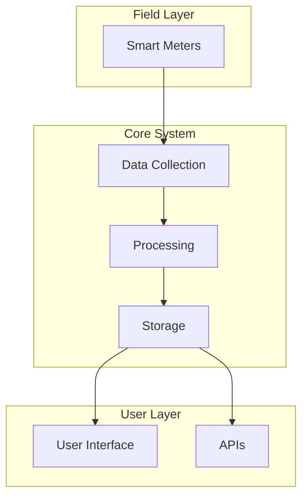
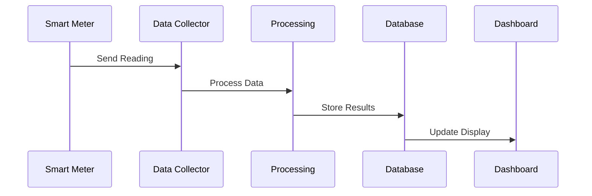
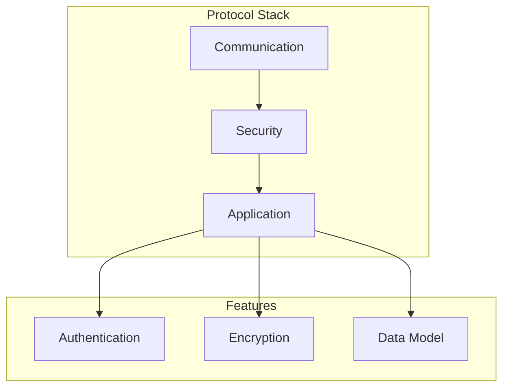
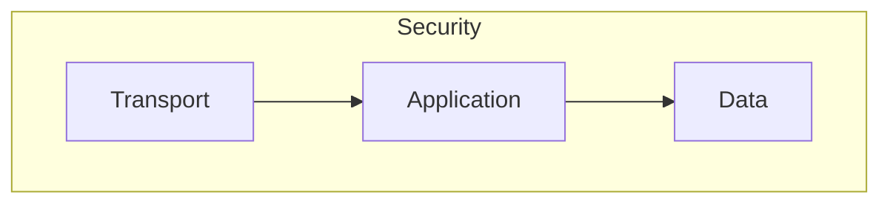
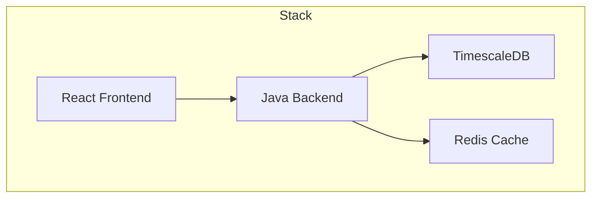

# HES System Presentation
---
                              
## Slide 1: Title
# Head End System (HES)
### Smart Meter Management Solution
- Enterprise-grade solution
- Real-time monitoring
- Scalable architecture

---

## Slide 2: System Overview
### What is HES?
- Comprehensive smart meter management system
- Handles millions of meter readings
- Real-time data processing
- Advanced analytics platform

---

## Slide 3: Key Features
1. 🔄 Real-time data collection
2. 🔒 Secure communication
3. 📊 Advanced analytics
4. 🖥️ Modern dashboard
5. ⚡ High performance

---

## Slide 4: Architecture Overview

---

## Slide 5: Data Flow

---

## Slide 6: DLMS/COSEM Integration

---

## Slide 7: Key Components
1. **Data Collection**
   - Protocol handling
   - Validation
   - Security

2. **Processing**
   - Real-time analytics
   - Stream processing
   - Event handling

3. **Storage**
   - Time-series data
   - Caching
   - Data warehouse

---

## Slide 8: Security Features

- Multi-layer security
- End-to-end encryption
- Access control
- Audit logging

---

## Slide 9: Performance
### System Capacity
- 1M+ meters
- 12M readings / 30min
- 1.2GB data / 30min

### Features
- Load balancing
- Horizontal scaling
- Data partitioning
- Caching

---

## Slide 10: Technology Stack

---

## Slide 11: Benefits
1. ✅ Improved efficiency
2. 📈 Real-time insights
3. 🔍 Better analytics
4. 💪 High scalability
5. 🛡️ Enhanced security

---

## Slide 12: Contact
### For More Information
- 📧 Technical Support
- 📚 Documentation
- 🔧 Implementation Guide

---

*Note: This presentation can be exported to PowerPoint with each markdown section representing a slide. The mermaid diagrams will need to be rendered as images.* 