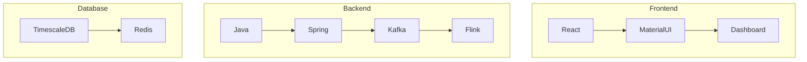

# HES System - Quick Overview

## What is HES?
Head End System (HES) is a comprehensive solution for managing smart meters at scale.

## Key Features
1. 🔄 Real-time meter data collection
2. 🔒 Secure DLMS/COSEM protocol
3. 📊 Advanced data analytics
4. 🖥️ Modern web dashboard
5. ⚡ High-performance architecture

## System Architecture (Simplified)

## Core Components
1. **Data Collection**
   - Meter communication
   - Protocol handling
   - Data validation

2. **Processing Engine**
   - Real-time analytics
   - Data aggregation
   - Event processing

3. **Storage System**
   - Time-series database
   - Caching layer
   - Data retention

4. **User Interface**
   - Real-time monitoring
   - Analytics dashboard
   - Alert management

## Key Statistics
- 📈 1M+ meters supported
- 🔄 12M readings / 30 minutes
- 💾 1.2GB data / 30 minutes
- ⚡ Real-time processing

## Technology Stack

## Security Features
1. 🔐 Authentication
2. 🔒 Encryption
3. 📝 Audit logging
4. 🛡️ Access control

## Benefits
1. ✅ Improved meter management
2. 📈 Real-time monitoring
3. 🔍 Advanced analytics
4. 💪 Scalable architecture
5. 🛡️ Enhanced security

## Contact
For more information:
- 📧 Technical Support
- 📚 Documentation
- 🔧 Troubleshooting Guide 