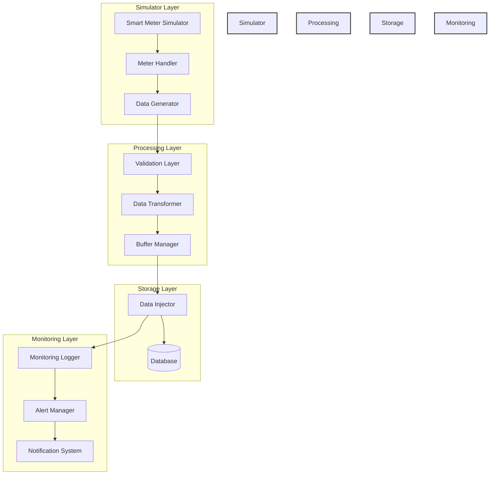
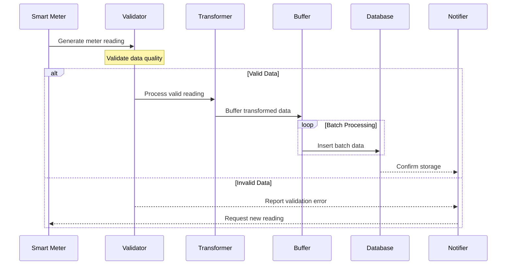
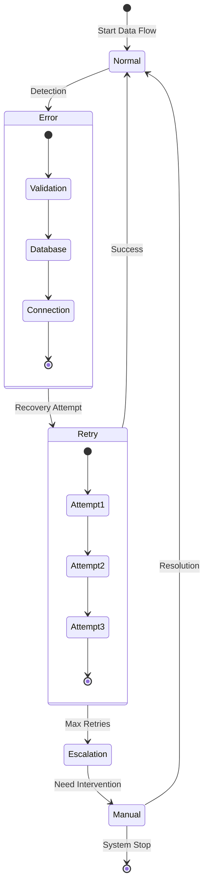
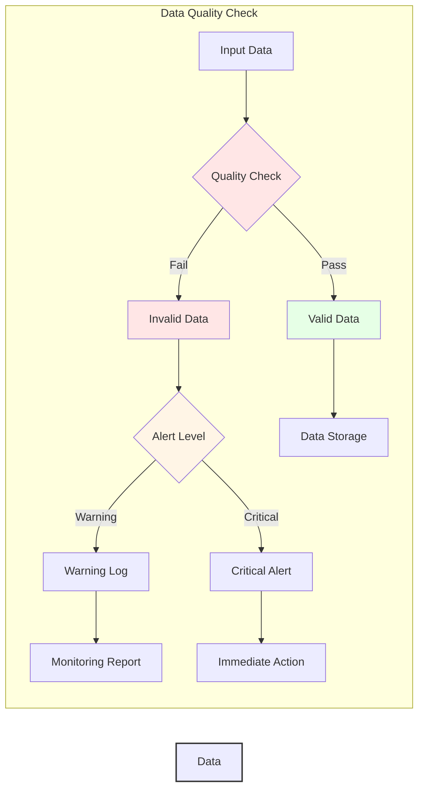

 # Error Handling and Recovery System Integration Patterns

This guide describes common integration patterns and best practices for integrating with the DLMS/COSEM simulator's error handling and recovery system.

## Table of Contents
1. [Event-Driven Integration](#event-driven-integration)
2. [External System Integration](#external-system-integration)
3. [Custom Recovery Actions](#custom-recovery-actions)
4. [Notification Routing](#notification-routing)
5. [Monitoring Integration](#monitoring-integration)
6. [Security Integration](#security-integration)
7. [Data Injection Service Integration](#data-injection-service-integration)
8. [Data Flow Architecture](#data-flow-architecture)

## Event-Driven Integration

### Subscribe to System Events

```typescript
import { RecoveryManager, SystemState, ComponentType } from '../core/recovery/RecoveryManager';
import { NotificationManager, NotificationType } from '../core/notifications/NotificationManager';

class SystemIntegration {
    private recoveryManager: RecoveryManager;
    private notificationManager: NotificationManager;

    constructor() {
        this.recoveryManager = RecoveryManager.getInstance();
        this.notificationManager = NotificationManager.getInstance();
        this.setupEventHandlers();
    }

    private setupEventHandlers() {
        // Error events
        this.recoveryManager.on('errorDetected', this.handleError);
        this.recoveryManager.on('errorResolved', this.handleResolution);
        this.recoveryManager.on('errorEscalated', this.handleEscalation);

        // State changes
        this.recoveryManager.on('componentStateChanged', this.handleStateChange);
        
        // Recovery events
        this.recoveryManager.on('recoveryAttempt', this.handleRecoveryAttempt);
        
        // Notification events
        this.notificationManager.on('notificationCreated', this.handleNotification);
    }

    private handleError = (error: SystemError) => {
        // Handle error detection
        console.log('Error detected:', error);
    };

    private handleResolution = (error: SystemError) => {
        // Handle error resolution
        console.log('Error resolved:', error);
    };

    private handleEscalation = (error: SystemError) => {
        // Handle error escalation
        console.log('Error escalated:', error);
    };

    private handleStateChange = (change: {
        component: ComponentType;
        oldState: SystemState;
        newState: SystemState;
    }) => {
        // Handle component state changes
        console.log('State changed:', change);
    };

    private handleRecoveryAttempt = (details: {
        errorId: string;
        attempt: number;
        success: boolean;
    }) => {
        // Handle recovery attempts
        console.log('Recovery attempt:', details);
    };

    private handleNotification = (notification: Notification) => {
        // Handle new notifications
        console.log('New notification:', notification);
    };
}
```

## External System Integration

### Monitoring System Integration

```typescript
import axios from 'axios';
import { NotificationManager, NotificationType, NotificationPriority } from '../core/notifications/NotificationManager';

class MonitoringIntegration {
    private notificationManager: NotificationManager;
    private monitoringEndpoint: string;
    private apiKey: string;

    constructor(config: {
        endpoint: string;
        apiKey: string;
    }) {
        this.notificationManager = NotificationManager.getInstance();
        this.monitoringEndpoint = config.endpoint;
        this.apiKey = config.apiKey;
        this.setupIntegration();
    }

    private setupIntegration() {
        this.notificationManager.subscribe(
            'monitoring-system',
            this.handleNotification.bind(this)
        );
    }

    private async handleNotification(notification: Notification) {
        try {
            await axios.post(
                this.monitoringEndpoint,
                {
                    source: 'DLMS-SIMULATOR',
                    timestamp: notification.timestamp,
                    level: this.mapPriorityToLevel(notification.priority),
                    type: notification.type,
                    message: notification.message,
                    details: notification.details
                },
                {
                    headers: {
                        'Authorization': `Bearer ${this.apiKey}`,
                        'Content-Type': 'application/json'
                    }
                }
            );
        } catch (error) {
            console.error('Failed to send notification to monitoring system:', error);
        }
    }

    private mapPriorityToLevel(priority: NotificationPriority): string {
        const levelMap = {
            [NotificationPriority.LOW]: 'info',
            [NotificationPriority.MEDIUM]: 'warning',
            [NotificationPriority.HIGH]: 'error',
            [NotificationPriority.CRITICAL]: 'critical'
        };
        return levelMap[priority];
    }
}
```

### Alert System Integration

```typescript
class AlertSystem {
    private notificationManager: NotificationManager;
    private emailService: EmailService;
    private smsService: SMSService;

    constructor(config: {
        email: EmailConfig;
        sms: SMSConfig;
    }) {
        this.notificationManager = NotificationManager.getInstance();
        this.emailService = new EmailService(config.email);
        this.smsService = new SMSService(config.sms);
        this.setupAlertRouting();
    }

    private setupAlertRouting() {
        this.notificationManager.subscribe(
            'alert-system',
            this.routeNotification.bind(this)
        );
    }

    private async routeNotification(notification: Notification) {
        switch (notification.priority) {
            case NotificationPriority.CRITICAL:
                await Promise.all([
                    this.sendEmail(notification),
                    this.sendSMS(notification)
                ]);
                break;
            case NotificationPriority.HIGH:
                await this.sendEmail(notification);
                break;
            default:
                // Log other notifications
                console.log('Non-critical notification:', notification);
        }
    }

    private async sendEmail(notification: Notification) {
        const emailContent = this.formatEmailContent(notification);
        await this.emailService.send(emailContent);
    }

    private async sendSMS(notification: Notification) {
        const smsContent = this.formatSMSContent(notification);
        await this.smsService.send(smsContent);
    }

    private formatEmailContent(notification: Notification) {
        // Format notification for email
        return {
            subject: `[${notification.priority}] ${notification.title}`,
            body: `
                Error Details:
                Type: ${notification.type}
                Message: ${notification.message}
                Time: ${notification.timestamp}
                
                Additional Details:
                ${JSON.stringify(notification.details, null, 2)}
            `
        };
    }

    private formatSMSContent(notification: Notification) {
        // Format notification for SMS
        return `
            ${notification.priority} Alert:
            ${notification.title}
            ${notification.message}
        `.trim();
    }
}
```

## Custom Recovery Actions

### Custom Recovery Handler

```typescript
class CustomRecoveryHandler {
    private recoveryManager: RecoveryManager;

    constructor() {
        this.recoveryManager = RecoveryManager.getInstance();
        this.registerCustomProcedures();
    }

    private registerCustomProcedures() {
        // Register custom recovery procedure
        this.recoveryManager.registerRecoveryProcedure({
            id: 'CUSTOM_ERROR',
            errorType: 'CUSTOM_ERROR',
            maxAttempts: 3,
            backoffStrategy: 'EXPONENTIAL',
            steps: [
                {
                    description: 'Custom validation',
                    action: this.customValidation.bind(this),
                    timeout: 5000
                },
                {
                    description: 'Custom recovery action',
                    action: this.customRecoveryAction.bind(this),
                    timeout: 10000
                }
            ],
            fallbackProcedure: 'MANUAL_INTERVENTION'
        });
    }

    private async customValidation(): Promise<boolean> {
        // Implement custom validation logic
        return true;
    }

    private async customRecoveryAction(): Promise<boolean> {
        // Implement custom recovery logic
        return true;
    }
}
```

## Notification Routing

### Custom Notification Router

```typescript
class NotificationRouter {
    private notificationManager: NotificationManager;
    private routes: Map<string, NotificationHandler>;

    constructor() {
        this.notificationManager = NotificationManager.getInstance();
        this.routes = new Map();
        this.setupRoutes();
    }

    private setupRoutes() {
        // Register route handlers
        this.routes.set('EMAIL', new EmailNotificationHandler());
        this.routes.set('SMS', new SMSNotificationHandler());
        this.routes.set('SLACK', new SlackNotificationHandler());
        this.routes.set('WEBHOOK', new WebhookNotificationHandler());

        // Subscribe to notifications
        this.notificationManager.subscribe(
            'notification-router',
            this.routeNotification.bind(this)
        );
    }

    private async routeNotification(notification: Notification) {
        // Get routing rules for notification
        const routes = this.getRoutingRules(notification);

        // Route notification to all handlers
        await Promise.all(
            routes.map(route => {
                const handler = this.routes.get(route);
                if (handler) {
                    return handler.handle(notification);
                }
            })
        );
    }

    private getRoutingRules(notification: Notification): string[] {
        // Determine routing based on notification properties
        const routes: string[] = [];

        switch (notification.priority) {
            case NotificationPriority.CRITICAL:
                routes.push('EMAIL', 'SMS', 'SLACK');
                break;
            case NotificationPriority.HIGH:
                routes.push('EMAIL', 'SLACK');
                break;
            case NotificationPriority.MEDIUM:
                routes.push('SLACK');
                break;
            default:
                routes.push('WEBHOOK');
        }

        return routes;
    }
}
```

## Monitoring Integration

### Metrics Collection

```typescript
class MetricsCollector {
    private recoveryManager: RecoveryManager;
    private metrics: {
        errors: number;
        recoveries: number;
        escalations: number;
        avgRecoveryTime: number;
    };

    constructor() {
        this.recoveryManager = RecoveryManager.getInstance();
        this.metrics = {
            errors: 0,
            recoveries: 0,
            escalations: 0,
            avgRecoveryTime: 0
        };
        this.setupMetricsCollection();
    }

    private setupMetricsCollection() {
        // Collect error metrics
        this.recoveryManager.on('errorDetected', () => {
            this.metrics.errors++;
        });

        // Collect recovery metrics
        this.recoveryManager.on('errorResolved', (error: SystemError) => {
            this.metrics.recoveries++;
            this.updateAverageRecoveryTime(error);
        });

        // Collect escalation metrics
        this.recoveryManager.on('errorEscalated', () => {
            this.metrics.escalations++;
        });
    }

    private updateAverageRecoveryTime(error: SystemError) {
        const recoveryTime = error.resolutionTime!.getTime() - error.timestamp.getTime();
        this.metrics.avgRecoveryTime = (
            (this.metrics.avgRecoveryTime * (this.metrics.recoveries - 1) + recoveryTime) /
            this.metrics.recoveries
        );
    }

    public getMetrics() {
        return {
            ...this.metrics,
            successRate: (this.metrics.recoveries / this.metrics.errors) * 100,
            escalationRate: (this.metrics.escalations / this.metrics.errors) * 100
        };
    }
}
```

## Security Integration

### Security Event Handler

```typescript
class SecurityEventHandler {
    private recoveryManager: RecoveryManager;
    private notificationManager: NotificationManager;
    private securityService: SecurityService;

    constructor(securityService: SecurityService) {
        this.recoveryManager = RecoveryManager.getInstance();
        this.notificationManager = NotificationManager.getInstance();
        this.securityService = securityService;
        this.setupSecurityHandling();
    }

    private setupSecurityHandling() {
        // Handle security-related errors
        this.recoveryManager.on('errorDetected', (error: SystemError) => {
            if (error.componentType === ComponentType.SECURITY) {
                this.handleSecurityError(error);
            }
        });

        // Register security recovery procedures
        this.registerSecurityProcedures();
    }

    private async handleSecurityError(error: SystemError) {
        // Log security event
        await this.securityService.logSecurityEvent({
            type: error.errorType,
            severity: error.severity,
            details: error.details,
            timestamp: error.timestamp
        });

        // Notify security team
        if (error.severity === 'CRITICAL') {
            await this.notifySecurityTeam(error);
        }
    }

    private async notifySecurityTeam(error: SystemError) {
        const notification = {
            type: NotificationType.ERROR,
            priority: NotificationPriority.CRITICAL,
            title: `Security Alert: ${error.errorType}`,
            message: error.message,
            details: {
                ...error.details,
                securityImpact: 'HIGH',
                requiredAction: 'IMMEDIATE'
            }
        };

        await this.notificationManager.notifyError(notification);
    }

    private registerSecurityProcedures() {
        // Register security-specific recovery procedures
        this.recoveryManager.registerRecoveryProcedure({
            id: 'SECURITY_BREACH',
            errorType: 'SECURITY_ERROR',
            maxAttempts: 1, // No retry for security breaches
            backoffStrategy: 'LINEAR',
            steps: [
                {
                    description: 'Security audit',
                    action: async () => {
                        await this.securityService.performAudit();
                        return true;
                    },
                    timeout: 30000
                },
                {
                    description: 'Lock down affected components',
                    action: async () => {
                        await this.securityService.lockdownComponents();
                        return true;
                    },
                    timeout: 10000
                }
            ]
        });
    }
}
```

## Data Injection Service Integration

### Meter Data Integration Handler

```typescript
import { DatabaseService } from '../services/DatabaseService';
import { MeterSimulator } from '../simulator/MeterSimulator';
import { DataValidator } from '../validation/DataValidator';

class MeterDataInjectionHandler {
    private databaseService: DatabaseService;
    private meterSimulator: MeterSimulator;
    private dataValidator: DataValidator;
    private isRunning: boolean = false;

    constructor(config: {
        dbConfig: DatabaseConfig;
        simulatorConfig: SimulatorConfig;
    }) {
        this.databaseService = new DatabaseService(config.dbConfig);
        this.meterSimulator = new MeterSimulator(config.simulatorConfig);
        this.dataValidator = new DataValidator();
    }

    public async startDataInjection(interval: number = 5000) {
        if (this.isRunning) {
            throw new Error('Data injection service is already running');
        }

        this.isRunning = true;
        
        while (this.isRunning) {
            try {
                // Get meter readings from simulator
                const meterData = await this.meterSimulator.getReadings();

                // Validate meter data
                const validatedData = await this.dataValidator.validateMeterData(meterData);

                // Transform data if needed
                const transformedData = this.transformMeterData(validatedData);

                // Inject data into database
                await this.databaseService.insertMeterData(transformedData);

                // Wait for next interval
                await new Promise(resolve => setTimeout(resolve, interval));
            } catch (error) {
                console.error('Error in data injection cycle:', error);
                // Implement error handling based on error type
                await this.handleInjectionError(error);
            }
        }
    }

    public async stopDataInjection() {
        this.isRunning = false;
    }

    private transformMeterData(data: MeterData): TransformedMeterData {
        return {
            meterId: data.meterId,
            timestamp: new Date(),
            readings: {
                voltage: data.voltage,
                current: data.current,
                power: data.power,
                frequency: data.frequency,
                energyConsumption: data.energyConsumption
            },
            status: {
                connectionStatus: data.connectionStatus,
                alarms: data.alarms,
                quality: data.quality
            }
        };
    }

    private async handleInjectionError(error: Error) {
        // Implement specific error handling logic
        if (error instanceof DatabaseError) {
            await this.handleDatabaseError(error);
        } else if (error instanceof ValidationError) {
            await this.handleValidationError(error);
        } else if (error instanceof SimulatorError) {
            await this.handleSimulatorError(error);
        }
    }

    private async handleDatabaseError(error: DatabaseError) {
        // Implement database error recovery
        await this.databaseService.reconnect();
    }

    private async handleValidationError(error: ValidationError) {
        // Log validation errors and potentially notify monitoring system
        console.error('Validation error:', error);
    }

    private async handleSimulatorError(error: SimulatorError) {
        // Handle simulator-specific errors
        await this.meterSimulator.reset();
    }
}

// Usage example
const dataInjectionHandler = new MeterDataInjectionHandler({
    dbConfig: {
        host: 'localhost',
        port: 5432,
        database: 'meter_data',
        username: 'admin',
        password: '****'
    },
    simulatorConfig: {
        simulationSpeed: 1,
        meterCount: 10,
        dataGenerationRate: 'REAL_TIME'
    }
});

// Start data injection with 5-second intervals
await dataInjectionHandler.startDataInjection(5000);
```

### Database Integration Configuration

```typescript
interface DatabaseConfig {
    host: string;
    port: number;
    database: string;
    username: string;
    password: string;
    poolSize?: number;
    timeout?: number;
    ssl?: boolean;
}

interface SimulatorConfig {
    simulationSpeed: number;
    meterCount: number;
    dataGenerationRate: 'REAL_TIME' | 'FAST' | 'HISTORICAL';
    startDate?: Date;
    endDate?: Date;
}

interface MeterData {
    meterId: string;
    voltage: number;
    current: number;
    power: number;
    frequency: number;
    energyConsumption: number;
    connectionStatus: 'CONNECTED' | 'DISCONNECTED';
    alarms: string[];
    quality: 'GOOD' | 'QUESTIONABLE' | 'BAD';
}

interface TransformedMeterData {
    meterId: string;
    timestamp: Date;
    readings: {
        voltage: number;
        current: number;
        power: number;
        frequency: number;
        energyConsumption: number;
    };
    status: {
        connectionStatus: string;
        alarms: string[];
        quality: string;
    };
}
```

## Data Flow Architecture

### Overall System Data Flow



### Detailed Data Processing Flow



### Error Recovery Flow



### Data Quality Monitoring Flow



## Best Practices

1. **Event Handling**
   - Use event-driven architecture for loose coupling
   - Handle events asynchronously when possible
   - Implement proper error handling in event handlers

2. **Integration Security**
   - Validate and sanitize all external inputs
   - Use secure communication channels
   - Implement proper authentication and authorization

3. **Recovery Actions**
   - Make recovery actions idempotent
   - Implement proper timeouts
   - Handle partial failures gracefully

4. **Notification Routing**
   - Implement priority-based routing
   - Handle delivery failures
   - Avoid notification storms

5. **Monitoring**
   - Collect relevant metrics
   - Implement proper aggregation
   - Set up meaningful alerts

6. **Error Handling**
   - Implement proper error categorization
   - Handle cascading failures
   - Provide meaningful error context 